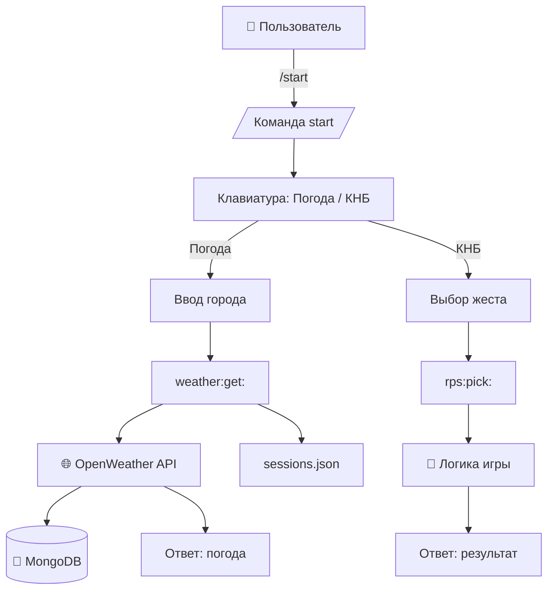

# 🤖 Telegram Weather & RPS Bot

Телеграм-бот на **aiogram 3.x**, который умеет:

* Показывать погоду через **OpenWeatherMap API** (данные сохраняются в MongoDB).
* Играть в **«Камень-Ножницы-Бумага»** через inline-кнопки.
* Контролировать нагрузку: не более **3 запросов погоды за 2 минуты** для одного пользователя.

Проект полностью контейнеризован (Docker, docker-compose), логи в JSON формате, покрыт тестами.

---

## 📂 Архитектура проекта

```
app/
  main.py                 # точка входа
  keyboards/
    inline.py             # inline-клавиатуры
  services/
    weather_client.py     # клиент OpenWeatherMap (aiohttp)
    mongo_client.py       # запись запросов в MongoDB
    rps.py                # логика игры КНБ
    sessions.py           # работа с sessions.json (лимиты)
  handlers/
    start.py              # обработчик команды /start
    weather.py            # обработчики для погоды
    rps.py                # обработчики для игры
  utils/
    logging.py            # JSON-логи
sessions.json             # файл активности пользователей
tests/
  test_rps.py             # тесты игры
  test_weather_client.py  # тесты погоды (моки)
  test_callbacks.py       # тесты клавиатур
Dockerfile
docker-compose.yml
requirements.txt
.env.example
README.md
```

---

## ⚙️ Стек технологий

* **Python 3.11+**
* **aiogram 3.x**
* **aiohttp 3.x**
* **MongoDB + motor**
* **mongo-express** (MongoWeiver — просмотрщик базы в браузере)
* **pytest + aioresponses** (тесты)
* **Docker, docker-compose**
* **JSON-логи** через python-json-logger

---

## 🚀 Установка и запуск

### 1. Клонирование репозитория

```bash
git clone https://github.com/your-username/weather-rps-bot.git
cd weather-rps-bot
```

### 2. Настройка переменных окружения

Скопируйте `.env.example` → `.env` и заполните:

```dotenv
BOT_TOKEN=ваш_бот_токен
OPENWEATHER_API_KEY=ваш_api_key
OPENWEATHER_BASE_URL=https://api.openweathermap.org/data/2.5
MONGO_URI=mongodb://mongo:27017
MONGO_DB=weather_bot
LOG_LEVEL=INFO
```

### 3. Запуск в Docker

```bash
docker-compose up --build
```

### 4. Доступы

* **Бот**: запускается автоматически, подключается к Telegram.
* **MongoDB**: `localhost:27017`
* **MongoWeiver (mongo-express)**: [http://localhost:8081](http://localhost:8081) (логин/пароль: `admin`/`admin`)

---

## 🔄 Сценарии работы

### `/start`

Показывает меню:

* «Погода»
* «КНБ»

---

### 🌤 Погода

1. Пользователь жмёт **Погода**.
2. Вводит город (например: «Алматы»).
3. Получает кнопку «Показать погоду».
4. Бот делает запрос в **OpenWeatherMap API**.
5. Результат:

   * Отправляется пользователю.
   * Сохраняется в **MongoDB**.
6. Ошибки API (404, 500, timeout) → дружелюбное сообщение.
7. ⚠️ Ограничение: не более **3 запросов за 2 минуты** (через `sessions.json`).

---

### ✊✌️✋ Камень-Ножницы-Бумага

1. Пользователь жмёт **КНБ**.
2. Выбирает жест (Камень / Ножницы / Бумага).
3. Бот случайно выбирает свой жест.
4. Отправляется результат (выиграл/проиграл/ничья) + кнопка «Сыграть ещё».

---

## 📂 Хранение данных

Все успешные запросы погоды сохраняются в MongoDB:

```json
{
  "city": "Алматы",
  "payload": { ... полный JSON ответа OWM ... },
  "ts": "2025-09-06T10:17:07Z"
}
```

Просматривать данные можно через [http://localhost:8081](http://localhost:8081).

---

## 🧪 Тесты

Запуск тестов:

```bash
pytest -q
```

* `test_rps.py` — проверка исходов игры при фиксированном «рандоме».
* `test_weather_client.py` — мок запросов к OpenWeather (200, 404, 500, timeout).
* `test_callbacks.py` — проверка корректности `callback_data` в клавиатурах.

---

## 📝 Логи

Все логи пишутся в JSON-формате на `stdout` (видны через `docker logs`).
Пример:

```json
{"asctime": "2025-09-06 12:00:00,123", "levelname": "INFO", "name": "app", "message": "Bot starting ..."}
```

Уровень логирования задаётся переменной окружения `LOG_LEVEL` (`INFO`, `DEBUG`, `WARNING` и т.д.).

---

## 📊 Схема работы



---

## ✅ Критерии приёмки

* `/start` показывает меню.
* Все взаимодействия идут через CallbackQuery.
* Погода работает, ошибки обрабатываются.
* Все успешные запросы сохраняются в MongoDB.
* MongoWeiver доступен.
* Лимит 3 запроса/2 минуты работает.
* КНБ работает, можно играть повторно.
* Всё запускается через Docker.
* Тесты проходят.
* Логи в JSON.
